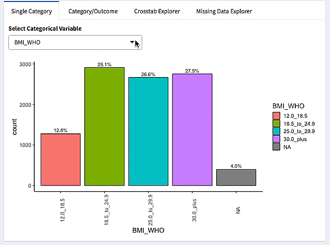

```{r setup, include=FALSE}
options(htmltools.dir.version = FALSE)
```
---
# Overview: Data Scavenger Hunts

- Introduction
- Why?
- What are they?
- Who are they For?
- Who are they for? (reprise)
- Call to Action

---
# Who am I?


- Assistant Professor at Oregon Health & Science University
- Many years working with bioinformatics data
- I want people to understand the data they generate
- I love teaching visualization


---
# Why? Looking at Data Together

- Visualization is empowering

--

- Visualization is accessible

--

- Visualization lets us have a conversation

--

- Visualization/Interpreting is a valuable skill

---

# What are Data Scavenger Hunts?

.pull-left[
- Social learning activity about a dataset
- Inspired by Exploratory Data Analysis
  - 'Find patterns, reveal structure (Behrens)'
- Understand associations between variables
  - How is Body Mass Index associated with Diabetes?
- Reflect/present discoveries to the group
]


---
# What? Burro

.pull-left[
- Burro[w] into the data!
- R Package/Shiny App for exploring many kinds of data
- Spin up a web app for any dataset
- Maps variable types to the appropriate visualizations
- Allow people to explore the data quickly
]

.pull-right[

]

---
# What? Burro Overview

.pull-left[
- Organized by variable types
- Overview Data
- Continuous vs Categorical Data
- Assess single variables first, then look at interactions by variable type
]

.pull-right[
  
]

---
# What? Burro Example

Looking for association of episodes of little interest with depressive episodes: 



---
# What? The Questions

- Have pre-prepared questions that guide exploration
- Questions range from simple to complex
- Map question types into visualization types

---
# What? Try it out

http://bit.ly/csv_burro

Try one of these questions:

- Why is age capped at 80 years in this dataset?
- Is marijuana use associated with depressive episodes?
- Are hours of sleep associated with depressive episodes?

---
# What: Reflection/Discussion

- Bring back our observations to the group
- Simple Template:
  - What was our question?
  - What was our evidence? How did we find it?
  - What other variables should we look at?
- Group reflection: what did we learn as a group?

---
# Who has participated?

- Graduate Students (clinical data wrangling course)
  - Sleep Heart Health Study Data
- BioData Club Members (NHANES Scavenger Hunt)
  - NHANES Data
- Undergraduate Students (Data Literacy)
  - NHANES Data
  
---
# What do they say (BioData Club)?

- "The scavenger hunt. It is great place to apply this knowledge."
- "I enjoyed the collaborative and self-paced approach."
- "I liked the dataset and the open curiosity element of the workshop."

---
# Who: Is this useful for Citizen Data?

- What would it take to make `burro` useful for citizen data efforts?
- Can it be used to teach graph literacy and data curiosity?

---
# Who: Spatial Data Exploration

- New example: Social Determinants of Health
- Prototyping with spatial data frames (shapefiles, sf)
  - Example app: 
---

# Call to action 

- Need help with usability testing/documentation
- Need help with workflows for different data types
- Need help with standardizing template for scavenger hunts

---
# Stay in Touch

These slides: http://bit.ly/csv_hunt

- laderast@ohsu.edu 
- @tladeras
- More about data scavenger hunts and `burro`:
    - http://laderast.github.io/burro/
- BioData Club: http://biodata-club.github.io
